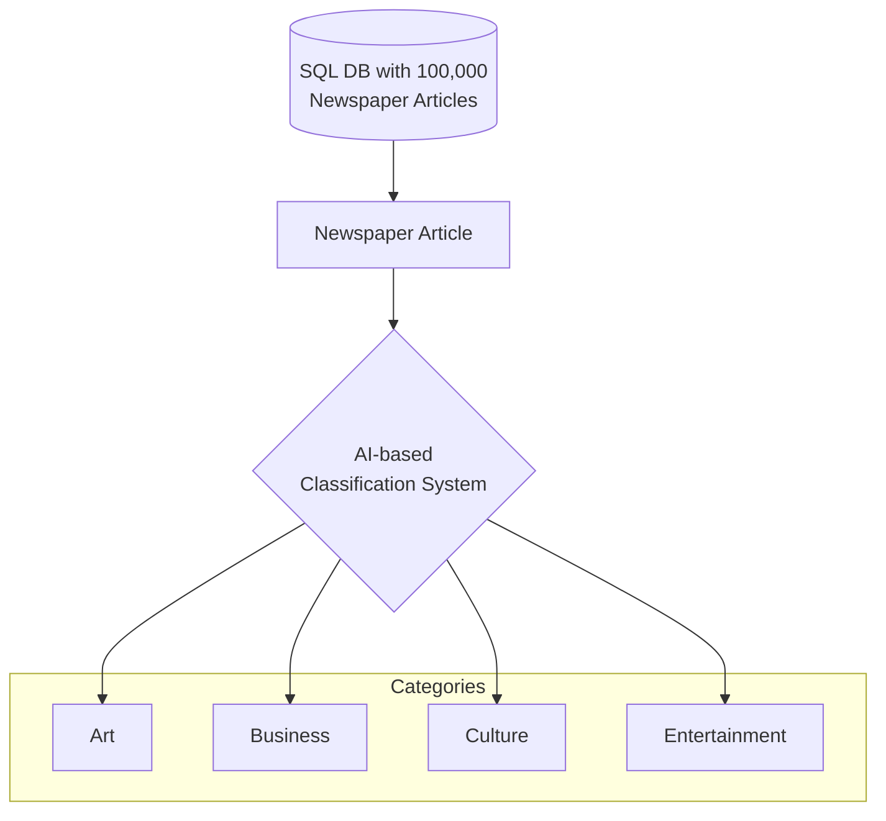
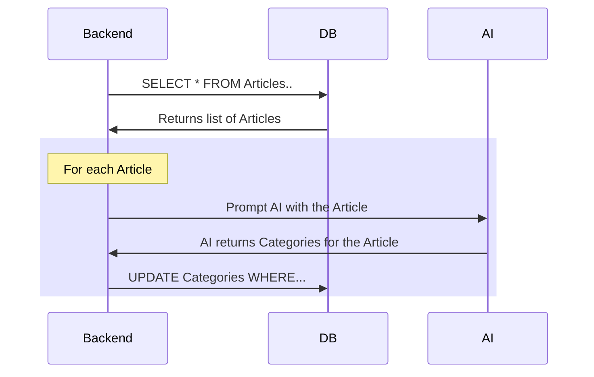
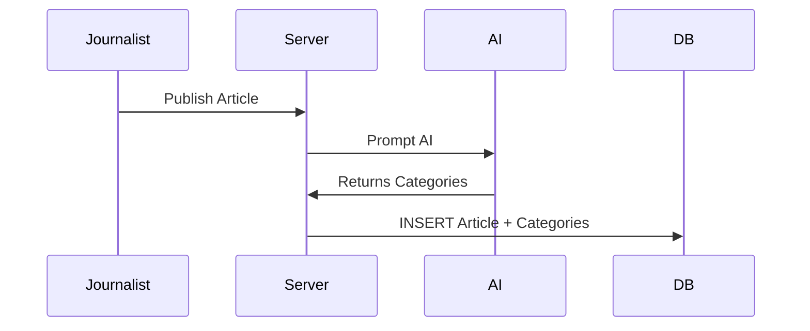

# Introduction

> 📖 **What is Generative AI?** Generative AI is a type of AI that can understand and generate human-like text. It can be used to perform a wide range of tasks, including data entry. It is also very **cost-effective**, as it **does not** require a team of data scientists and machine learning engineers to implement.

I was doing some cost calculations for some clients who were interested in the effectiveness of Generative AI in a data entry setting. The questions that came up were along the lines of:

* How much does it cost to use Generative AI?
* What are the cost savings compared to traditional methods of data entry?
* How does the cost of using Generative AI compare to the cost of hiring a team of data entry clerks?
* Are there any advantages to using Generative AI over traditional methods of data entry?

Before doing my calculations, I had some idea about how much money could be saved using GenAI. But, to be honest, the result was so dramatic that even I was surprised. 

According to my calculations, a whopping **97.84% reduction in unit cost of data entry** (!!) could be realized using Generative AI, using just prompting, without any custom fine-tuning or training of models.

I am sharing my results here in the form of a fictional case study. I hope this will be useful for anyone who is interested in the cost-effectiveness of Generative AI, especially in a data entry setting.

# What is Generative AI?

Before we dive into the case study, let's take a moment to understand what Generative AI is.

Generative AI is a type of AI that can understand and generate human-like text. It can be used to perform a wide range of tasks, including data entry. It is also very cost-effective, as **it does not require a team of data scientists and machine learning engineers to use.** Instead, there are many AI models that are open source or, even more simple, made available by 3rd party vendors over API.

Because these AI models come pre-trained on a broad base of source materials, they are very simple to use. You only have to provide clear instructions in plain text format, and the AI will do the rest. It is very scalable and flexible as a result. This also means that there are no training costs involved.

Generative AI is also inexpensive. It is much cheaper than hiring data entry clerks. For a single article, the cost of using Generative AI is only a few cents.

# Case Study

## A new requirement for Acme News

In this hypothetical scenario, Acme News is a large newspaper company. Acme's Product and Design teams have been hard at work re-designing the newspaper's main customer-facing website, which sees many millions of visitors per month.

Part of the redesign involves a Proof of Concept for a brand new "category" filter. This filter will let users rapidly navigate articles using one of exactly 4 categories:

* Art
* Business
* Culture
* Entertainment

The newspaper plans to expand these categories to several dozen in the future, but for now, they are starting with just these four. As new categories are added, the newspaper's database will need to be re-classified for each new category.

## The work involved

In addition to the normal work of software development, this feature requires a significant amount of data entry. This is because the newspaper's database contains 100,000 past articles that need to be classified into one or more of these four new categories, and each new article will need to be classified as it is published.

Furthermore, as the number of categories grows, the database will need to be re-classified for each new category. This is a significant amount of work, and it is also repetitive since Acme plans to grow the number of categories to several dozen in the next 5 years.

## Disadvantages of the current process

Acme has previously used data entry clerks to classify the articles. From experience, the manual data entry process has a few significant disadvantages, which is the reason why Acme is looking for a new solution.

* **Manual data entry is slow.** It takes a long time to read each article and then enter the categories into the database. This is a bottleneck for the project, since the new feature cannot be launched until all 100,000 articles have been classified.
* **It is also expensive.** The data entry clerks are paid by the hour, and the cost of hiring them adds up quickly. When a clerk leaves and a new one is hired, there is also a cost associated with training the new clerk.
* **This process is not scalable.** As the number of categories grows, it requires a re-classification of all the old articles for each new category. This is a significant amount of work, and it is also expensive.
* **And it isn't flexible, either.** As more categories are added, the data entry clerks need to be re-trained for each new category, which is an additional cost.

## 🧮 Calculating the cost difference

I have created a simple calculator below to compare the unit cost of using data entry clerks versus using Generative AI. As you can see, the unit cost of using Generative AI is much lower than that of using data entry clerks.

<div id="calculator-root"></div>

As we can see, if we used Generative AI, this would be much faster, cheaper, and more accurate than using data entry clerks. The AI could read the articles and then classify them into one or more categories. As the categories change, the AI could be modified to understand the new categories as well.

***Note:** The data entry costs are assumptions, but the actual costs don't matter for this comparison since the difference is so great.*

***Also worth noting:** There is a cost for building the system that loads the articles into the AI and saves the classifications to the DB. This is not included in the calculator, but it is likely to be a one-time cost based on implementation effort.*

# Impact of using AI in data classification.

>💡 **Did you know:** Most commercial Generative AI projects **do not require data scientists or ML engineers**. Thanks to prompting, traditional web developers and software engineers can easily and cost-effectively implement AI-driven processes without the need for ML/AI specialists.

## Analysis of Advantages of using AI for data classification

### Cost Efficiency

In the default example above, we estimate a cost of **$10,000** At an hourly salary of $10/hour, and with an average speed of 100 articles classified per hour. On the other hand, classifying 100,000 newspaper articles using GPT-3.5 Turbo, considering the specified input and output token costs, would approximately cost **$215.83**. This demonstrates the cost-effectiveness of AI-based classification over traditional manual methods.

### Speed and time savings

The time savings are also significant. The AI processes 100,000 articles **within a handful of hours** when parallelized properly, offering massive time savings over manual methods. This is especially important for Acme News, as the new feature cannot be launched until all 100,000 articles have been classified.

### Scalability & Flexibility

As the number of categories grows, the AI prompt can be easily modified to understand the new categories without additional training, making it a flexible solution for future expansion. Also, since the AI can re-classify the existing 100,000+ articles almost instantly (i.e. potentially within a handful of hours, when parallelized properly), it is a scalable solution for future growth. This is a significant advantage over manual methods, which require re-training for each new category, as well as a similar lead time for re-classifying the existing articles.

### Workforce Shift

Transitioning to AI classification changes workforce demands, reducing manual processing roles in favor of software engineers. This is a significant advantage for Acme News, as it allows them to use their existing software development team to implement the AI-driven process. There is no need for specialized AI expertise, and the code fits seamlessly into existing software built in Java, JavaScript, Python, etc.

### Future-proofing

As AI models improve, the cost of using AI will continue to decrease, while the cost of using data entry clerks will continue to increase. This is because the cost of using AI is based on the cost of computing power, which is decreasing, while the cost of using data entry clerks is based on the cost of labor, which is increasing.

# Technical Implementation

>💡 **Did you know:** Generative AI systems are flexible. They can be rolled into either  a **batch process** or an **API action**. AI-driven processes can read database entries, classify them, and save the new information back to the database.

The implementation is straightforward for any software engineer with prompt engineering skills. Without prompt engineering skills, there is a learning curve, but it is not as steep as traditional education in AI/ML skills.

The AI model will be used to classify the articles into the given categories. The AI model will return a list of categories that it believes the article belongs to. This list will then be stored in the database, which will require a new field to store the categories.

## No need to hire new specialists

Generative AI work can be performed by traditional web developers and software engineers. The code fits seamlessly into existing software built in Java, JavaScript, Python, etc. There are probably very few changes required to CI/CD pipelines or development processes.

Previously, AI was only feasible for large corporations like Google and Facebook. This is because AI previously required data scientists and ML engineers to implement. However, this is no longer true. Generative AI makes the power of AI accessible to small and medium-sized companies. Now, any software development team can use AI, regardless of which programming language they are using. 

This is possible through API-based AI (for example, OpenAI GPT-3.5 and Claude Instant) or through open source models that can run on consumer hardware or on a relatively inexpensive server (such as Mistral 7B). 

In our case, Acme's code is (probably) already making API calls for external integrations, and so the skillset (probably) already exists in the team. Therefore, Acme can easily take advantage of cheap industrial-grade AI over APIs, like OpenAI GPT-3.5. 

## The re-classification batch process

> 📖 **What is Data classification?** Data Classification is a common task in software development. It involves taking a piece of data and assigning it to one or more categories. This is a common task in many industries, including news, e-commerce, and social media.

The new re-classification system will be designed to be a simple batch process. It will read the articles from the database, and then use a Generative AI model to classify the articles into the given categories. The AI model will return a list of categories that it believes the article belongs to. This list will then be stored in the database.



## Data structures and database changes

The input data is a newspaper article that already exists inside Acme's SQL database. For example, here is a sample newspaper article as retrieved from their database.

```js
// source data format
{
  "title": "The Renaissance of Artisan Crafts in the Digital Age",
  "author": "Jordan Lee",
  "date_published": "2024-02-17",
  "category": "Art & Business",
  "tags": ["Artisan Crafts", "Digital Marketplace", "Cultural Preservation"],
  "content": "In an era dominated by mass production and digital technology, there's a growing movement towards the renaissance of artisan crafts, blending tradition with innovation....."
}
```

We need to add a new field to the database called "category" which will contain an array of strings. Each string will represent a category that the article belongs to. For example, the above article could be classified as "business" and "culture."

***Note:** It might be a better idea to create a separate table for categories and then link the articles to the categories. This would follow the principles of database normalization and would make it easier to add new categories in the future. But for simplicity, we will use a single table for this example.*

```js
// changes to the database
{
    "title": "The Renaissance of Artisan Crafts in the Digital Age",
    "author": "Jordan Lee",
    // ... etc
    "category": ["art", "business"] // this is a new JSON field
}
```

We will write a script that will read the article from the database, and then use a Generative AI model to classify the article into one or more categories. The AI model will a list of categories that it believes the article belongs to. We will then store this list in the database.

## The AI model prompt

> 🎓 **Are you implementing this right now?** You might be interested in my other article, [How to reliably return well-structured JSON from LLMs using Function Calling](/2024/02/17/how-to-reliably-return-well-structured-json-from-llms-using-function-calling), which shows how developers can get the LLM to play nicely with traditional code that expects structured JSON responses.

Ideally, the prompt should be a clear and concise question that the AI model can understand. It should also be a question that the AI model can answer accurately. The prompt should also be easy to understand and easy to maintain.

Here is an example of a prompt that we could use:

```markdown
There are four categories that an article can belong to: Art, Business, Culture, and Entertainment. Here are their definitions:

* Art: Articles about art, including visual arts, music, and literature.
* Business: Articles about business, including finance, economics, and entrepreneurship.
* Culture: Articles about culture, including traditions, customs, and social issues.
* Entertainment: Articles about entertainment, including movies, music, and television.

Please classify this article into one or more categories: Art, Business, Culture, Entertainment. Return the categories as a JSON list of strings. For example, `["art", "business"]` or `["culture"]`.

If the article does not belong to any of these categories, please return an empty list, `[]`.
```

Visualized in a sequence diagram, the flow looks like this. Notice that it's between the AI model, the database, and the backend script.



## Future expansion for new categories

As the number of categories grows, the AI prompt can be easily modified to understand the new categories without additional training. The prompt can be modified to include the new categories, and the AI model will be able to understand the new categories as well.

For example, if Acme News decides to add a new category called "Technology", the prompt can be modified to include the new category. The AI model will then be able to understand the new category as well.

Here is a sample updated prompt that we could use to classify an article into the new "Technology" category:

```markdown
There are five categories that an article can belong to: Art, Business, Culture, Entertainment, and Technology. Here are their definitions:

* Art: Articles about art, including visual arts, music, and literature.
* Business: Articles about business, including finance, economics, and entrepreneurship.
* Culture: Articles about culture, including traditions, customs, and social issues.
* Entertainment: Articles about entertainment, including movies, music, and television.
* Technology: Articles about technology, including computers, software, and the internet.

Please classify this article into one or more categories: Art, Business, Culture, Entertainment. Return the categories as a JSON list of strings. For example, `["art", "business"]` or `["culture"]` or `["technology", "entertainment"]`.

If the article does not belong to any of these categories, please return an empty list, `[]`.
```

## Live API-driven classification

In addition to the batch process, the AI model can also be used to classify articles in real-time as they are published. This can be done by creating an API endpoint that accepts an article as input, and then uses the AI model to classify the article into one or more categories. The API endpoint can then return the list of categories that the article belongs to.



This is a significant advantage over manual methods, which require re-training for each new category, as well as a similar lead time for re-classifying the existing articles.

# What are the gotchas?

* **Accuracy:** The AI model may not always classify the articles correctly. It is important to have a human review process in place to catch any mistakes made by the AI model.
* **Implementation Cost:** Integrating with an AI requires software engineering work. It is important to calculate the cost of using the AI model before deciding to use it.
* **Advanced use cases require skill:** Prompt design and understanding of the AI model's capabilities are important. This skill is not as common as traditional software engineering skills.


# Conclusion

This exploration into Generative AI's application for data entry reveals a transformative potential for cost, efficiency, and scalability across various industries. This case study demonstrates that by leveraging pre-trained AI models, businesses can achieve a staggering 97.84% reduction in data entry costs without the need for specialized AI training or expertise. 

The implementation of such technology not only promises immediate financial savings but also introduces a new paradigm in how we approach data processing tasks. It underscores the accessibility of advanced AI solutions to a broader range of businesses, including those without in-house AI expertise. The case of Acme News illustrates a practical application, showcasing the seamless integration of Generative AI into existing systems to streamline operations and future-proof against the increasing demands of data management. 

I am excited to see how this will change the way we think about data entry and classification. I hope this case study has been useful for anyone who is interested in Generative AI from a practical, cost-effective perspective.

_Special thanks to my friend [Paul Wujek](https://www.linkedin.com/in/paulwujek) for his valuable feedback on this article._


<script src="https://unpkg.com/mermaid@8.9.3/dist/mermaid.min.js"></script>
<script>
    document.addEventListener('DOMContentLoaded', () => {
        mermaid.initialize({
            startOnLoad:true,
            theme: "default",
        });
        window.mermaid.init(undefined, document.querySelectorAll('.language-mermaid'));
    });
</script>

<script>
    const calculatorDom = `
<table class="table">
    <tr>
        <th>Number of Articles</th>
        <td>
            <div class="flex flex-col gap-2">
                <input class="w-full" type="range" min="1000" max="1000000" value="100000" onInput="onInputChange()" id="numArticles">
                <p><span id="numArticlesValue">100000</span> Articles</p>
            </div>
        </td>
    </tr>
    <tr>
        <th>Manual Entry Speed (articles/hour)</th>
        <td>
            <div class="flex flex-col gap-2">
                <input type="range" min="50" max="200" value="100" onInput="onInputChange()" id="manSpeed">
                <p><span id="manSpeedValue">100</span> articles per hour</p>
            </div>
        </td>
    </tr>
    <tr>
        <th>Manual Entry Salary ($/hour)</th>
        <td>
            <div class="flex flex-col gap-2">
                <input type="range" min="1" max="30" value="10" onInput="onInputChange()" id="manSalary">
                <p>$<span id="manSalaryValue">10</span> per hour</p>
            </div>
        </td>
    </tr>
    <tr>
        <th>Average Article Length (words)</th>
        <td>
            <div class="flex flex-col gap-2">
                <input type="range" min="300" max="10000" value="5000" onInput="onInputChange()" id="avgArticleLength">
                <p><span id="avgArticleLengthValue">5000</span> words</p>
            </div>
        </td>
    </tr>
    <tr>
        <th>Total Manual Cost:</th>
        <td>
            <div>
                <strong class="text-error">$<span id="estimatedManualCost">10,000</span></strong>
                <p class="font-italic opacity-4">($<span id="manPerArticleCost">--</span> per article)</p>
            </div>
        </td>
    </tr>
    <tr>
        <th>Total Cost Using AI:</th>
        <td>
            <div>
                <strong>$<span id="estimatedAiCost">215.83</span></strong>
                <p class="font-italic opacity-4">($<span id="aiPerArticleCost">--</span> per article, using OpenAI GPT-3.5)</p>
            </div>
        </td>
    </tr>
    <tr>
        <th>Savings in Dollars:</th>
        <td class="text-success"><strong class="text-5">$<span id="estimatedSavings">--</span></strong></td>
    </tr>
    <tr>
        <th>Savings Percentage:</th>
        <td class="text-success"><strong class="text-5"><span id="estimatedPctSavings">--</span>%</strong></td>
    </tr>
</table>
<div class="link float-right cursor-pointer" onClick="resetToDefaults()">Reset To Default</div>
`;

    function resetToDefaults() {
        document.getElementById("numArticles").value = 100000;
        document.getElementById("manSpeed").value = 100;
        document.getElementById("manSalary").value = 10;
        document.getElementById("avgArticleLength").value = 5000;
        onInputChange();
    }

    function calculateManualCost() {
        const numArticles = parseInt(document.getElementById("numArticles").value, 10);
        const manSpeed = parseInt(document.getElementById("manSpeed").value, 10);
        const manSalary = parseInt(document.getElementById("manSalary").value, 10);
        
        const hours = numArticles / manSpeed;
        const cost = hours * manSalary;
        
        return cost;
    }

    function calculateAiCost() {
        const numArticles = parseInt(document.getElementById("numArticles").value, 10);
        const avgArticleLength = parseInt(document.getElementById("avgArticleLength").value, 10);

        const AVG_TOKENS_PER_WORD = 1.2;
        const totalInputTokens = (numArticles * avgArticleLength) / AVG_TOKENS_PER_WORD;
        const averageInputCostPer1000Tokens = 0.0005;
        const inputCost = averageInputCostPer1000Tokens * (totalInputTokens / 1000);

        const averageOutputLength = 50;
        const averageOutputCostPer1000Tokens = 0.0015;
        const totalOutputTokens = numArticles * averageOutputLength;
        const outputCost = averageOutputCostPer1000Tokens * (totalOutputTokens / 1000);

        const totalCost = inputCost + outputCost;

        return totalCost;
    }

    function onInputChange() {
        document.getElementById("numArticlesValue").innerText = document.getElementById("numArticles").value;
        document.getElementById("manSpeedValue").innerText = document.getElementById("manSpeed").value;
        document.getElementById("manSalaryValue").innerText = document.getElementById("manSalary").value.toLocaleString("en-US", {minimumFractionDigits: 2, maximumFractionDigits: 2});
        document.getElementById("avgArticleLengthValue").innerText = document.getElementById("avgArticleLength").value;
        
        const manCost = calculateManualCost();
        const aiCost = calculateAiCost();
        document.getElementById("estimatedManualCost").innerText = manCost.toLocaleString("en-US", {minimumFractionDigits: 2, maximumFractionDigits: 2});
        document.getElementById("estimatedAiCost").innerText = aiCost.toLocaleString("en-US", {minimumFractionDigits: 2, maximumFractionDigits: 2});
        document.getElementById("manPerArticleCost").innerText = (manCost / parseInt(document.getElementById("numArticles").value, 10)).toLocaleString("en-US", {minimumFractionDigits: 3, maximumFractionDigits: 3});
        document.getElementById("aiPerArticleCost").innerText = (aiCost / parseInt(document.getElementById("numArticles").value, 10)).toLocaleString("en-US", {minimumFractionDigits: 4, maximumFractionDigits: 4});

        const savings = manCost - aiCost;
        document.getElementById("estimatedSavings").innerText = savings.toLocaleString("en-US", {minimumFractionDigits: 2, maximumFractionDigits: 2});
        const savingsPct = ((savings) / manCost) * 100;
        document.getElementById("estimatedPctSavings").innerText = savingsPct.toLocaleString("en-US", {minimumFractionDigits: 2, maximumFractionDigits: 2});
    }

    document.addEventListener("DOMContentLoaded", () => {
        document.getElementById("calculator-root").innerHTML = calculatorDom;
        onInputChange(); // Initialize with default values
    });
</script>