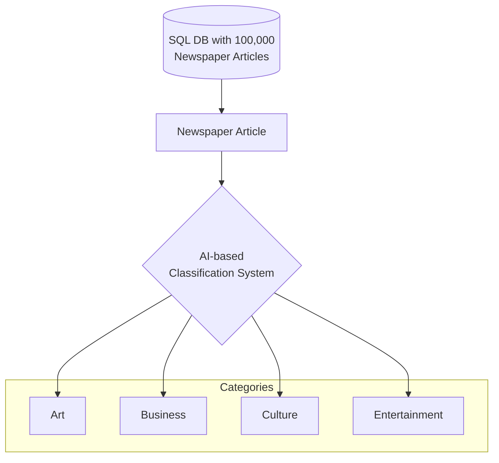

I was doing a few back-of-the-napkin calculations for some business clients about how cost-effective generative AI could be in their project. 

According to my calculations, a whopping **97.43% reduction in unit cost of data entry** could be realized using Generative AI, without any custom fine-tuning or training of models (i.e. through using just prompts to guide the model's behaviour). 

I wanted to share my thoughts using a concrete example. There is also a simple calculator embedded inside this case study for folks who are interested in playing around with the numbers.

# The Scenario: Newspaper Article Reclassification

In this hypothetical scenario, we will take on the role of the software engineering department of a large online newspaper. We have just received a request for a new feature which requires manual data entry on an ongoing basis. 

I will first describe this new feature request. Then, I will show how this task could be completed by humans; and then show how we can write code to complete this task, and finally compare the two approaches side by side.

## "Filter by Category" is a new feature request

Acme News is a large newspaper company. Acme's Product and Design teams have been hard at work re-designing the newspaper's main customer-facing website, which sees many millions of visitors per month. 

Part of the redesign involves a Proof of Concept for a brand new "category" filter. This filter will let users rapidly navigate articles using four categories:

* Art
* Business
* Culture
* Entertainment

_(In reality, we could have 100's of categories. This is also feasible and does not make a huge difference for the AI. In this example, I'm going to keep things simple with just 4 categories)_

## The problem: We need to classify 100,000 newspaper old articles, and continuously classify new articles as they are published.

There's just one problem. The four categories presented above are brand new, and the newspaper's database contains 100,000 past articles that need to be classified into one or more of these four new categories.

Furthermore, new articles will be added to the database every day, and these will also need to be classified into one or more of these four new categories.

## The current process: Manual data entry

Acme has previously built features that require data entry. Each time, they have hired a team of data entry clerks to manually read each article and then enter the categories into the database. When a new article is published, the data entry clerks are responsible for classifying the article into one or more categories.

## Disadvantages of the current process

From experience, this has a few disadvantages: 

* **Slow.** It takes a long time to read each article and then enter the categories into the database. This is a bottleneck for the project, since the new feature cannot be launched until all 100,000 articles have been classified.
* **Expensive.** The data entry clerks are paid by the hour, and the cost of hiring them adds up quickly. When a clerk leaves and a new one is hired, there is also a cost associated with training the new clerk.
* **Error-prone.** The data entry clerks are human, and they can make mistakes. This can lead to incorrect categorization of articles. This is especially problematic when the categories change, as the data entry clerks need to be re-trained.
* **Not scalable.** As the number of articles grows, the cost of hiring data entry clerks grows too. This is a problem for Acme, as they are planning to grow their database to 1,000,000 articles in the next 12 months.
* **Not flexible.** If the categories change, the data entry clerks need to be re-trained. 

The current process for classifying articles is manual. A team of data entry clerks are responsible for reading each article and then manually entering the categories into the database.

## Exploring AI-based data entry

Someone suggests that we could use AI to classify the articles. This would be much faster, cheaper, and more accurate than using data entry clerks. The AI could read the articles and then classify them into one or more categories. As the categories change, the AI could be modified to understand the new categories as well.

## Busting the myth: AI is not expensive

Currently, Acme Inc is not using AI for any of its projects. They believe that AI is expensive and that it requires a team of data scientists and machine learning engineers to implement. They also believe that AI is only useful for large companies like Google and Facebook.

However, this is not true. AI is now accessible to small and medium-sized companies. This is because of a new type of AI called Generative AI. 

## What is Generative AI?

Generative AI is a type of AI that can understand and generate human-like text. It can be used to perform a wide range of tasks, including data entry. It is also very cost-effective, as it does not require a team of data scientists and machine learning engineers to implement. There are also no training costs, as the AI comes pre-trained on a broad base of source materials. You only have to provide clear instructions in plain text format, and the AI will do the rest.

## The architecture of the new AI-driven system

The new system will be designed to be a batch process. It will read the articles from the database, and then use a Generative AI model to classify the articles into the given categories. 

The AI model will return a list of categories that it believes the article belongs to. This list will then be stored in the database.

In traditional data science terms, this is a **Document Classification** task, which falls under the broader umbrella of Data Classification. Other tasks under the Data Classification umbrella include Named Entity Recognition (NER), Sentiment Analysis, and Intent Recognition.

### Diagram of the new system to be designed



### What is the source data format?

The input data is a newspaper article that already exists inside Acme's SQL database. For example, here is a sample newspaper article as retrieved from their database.

```json
{
  "title": "The Renaissance of Artisan Crafts in the Digital Age",
  "author": "Jordan Lee",
  "date_published": "2024-02-17",
  "category": "Art & Business",
  "tags": ["Artisan Crafts", "Digital Marketplace", "Cultural Preservation"],
  "content": "In an era dominated by mass production and digital technology, there's a growing movement towards the renaissance of artisan crafts, blending tradition with innovation....."
}
```

### What do we need to do with the source data?

We need to add a new field to the database called "category" which will contain an array of strings. Each string will represent a category that the article belongs to. For example, the above article could be classified as "business" and "culture."

```js
{
    "title": "The Renaissance of Artisan Crafts in the Digital Age",
    "author": "Jordan Lee",
    // ... etc
    "category": ["art", "business"] // this is a new JSON field
}
```

### How will we do this?

We will write a script that will read the article from the database, and then use a Generative AI model to classify the article into one or more categories. The AI model will a list of categories that it believes the article belongs to. We will then store this list in the database.

### What should the prompt look like?

Ideally, the prompt should be a clear and concise question that the AI model can understand. It should also be a question that the AI model can answer accurately. The prompt should also be easy to understand and easy to maintain.

Here is an example of a prompt that we could use:

```markdown
There are four categories that an article can belong to: Art, Business, Culture, and Entertainment. Here are their definitions:

* Art: Articles about art, including visual arts, music, and literature.
* Business: Articles about business, including finance, economics, and entrepreneurship.
* Culture: Articles about culture, including traditions, customs, and social issues.
* Entertainment: Articles about entertainment, including movies, music, and television.

Please classify this article into one or more categories: Art, Business, Culture, Entertainment. Return the categories as a JSON list of strings. For example, `["art", "business"]` or `["culture"]`.

If the article does not belong to any of these categories, please return an empty list, `[]`.
```

<div id="calculator-root"></div>

<script>
    const calculatorDom = `
<h1>Unit Cost Savings Calculator</h1>
<p>You can use this calculator to see how much money you could save on data entry by using AI. The calculations are based on the case study below.</p>
<br/>
<table>
    <tr>
        <td>Number of Articles</td>
        <td>
            <input type="range" min="1000" max="1000000" value="100000" onInput="onInputChange()" id="numArticles">
            <span id="numArticlesValue">100000</span>
        </td>
    </tr>
    <tr>
        <td>Manual Entry Speed (articles/hour)</td>
        <td>
            <input type="range" min="50" max="200" value="100" onInput="onInputChange()" id="manSpeed">
            <span id="manSpeedValue">100</span> articles per hour
        </td>
    </tr>
    <tr>
        <td>Manual Entry Salary ($/hour)</td>
        <td>
            <input type="range" min="1" max="30" value="10" onInput="onInputChange()" id="manSalary">
            $<span id="manSalaryValue">10</span> per hour
        </td>
    </tr>
    <tr>
        <td>Manual Entry Cost:</td>
        <td><strong>$<span id="estimatedManualCost">10,000</span></strong></td>
    </tr>
    <tr>
        <td>Cost using AI:</td>
        <td><strong>$<span id="estimatedAiCost">257.50</span></strong> (Using OpenAI GPT-3.5 Turbo)</td>
    </tr>
    <tr>
        <td>Savings Percentage:</td>
        <td><strong><span id="estimatedPctSavings">--</span>%</strong></td>
    </tr>
</table>
<div class="link float-right cursor-pointer" onClick="resetToDefaults()">Reset To Default</div>
`;

    function resetToDefaults() {
        document.getElementById("numArticles").value = 100000;
        document.getElementById("manSpeed").value = 100;
        document.getElementById("manSalary").value = 10;
        onInputChange();
    }

    function calculateManualCost() {
        const numArticles = parseInt(document.getElementById("numArticles").value, 10);
        const manSpeed = parseInt(document.getElementById("manSpeed").value, 10);
        const manSalary = parseInt(document.getElementById("manSalary").value, 10);
        
        const hours = numArticles / manSpeed;
        const cost = hours * manSalary;
        
        return cost;
    }

    function calculateAiCost() {
        const numArticles = parseInt(document.getElementById("numArticles").value, 10);

        const averageInputLength = 5000;
        const totalInputTokens = numArticles * averageInputLength;
        const averageInputCostPer1000Tokens = 0.0005;
        const inputCost = averageInputCostPer1000Tokens * (totalInputTokens / 1000);

        const averageOutputLength = 50;
        const averageOutputCostPer1000Tokens = 0.0015;
        const totalOutputTokens = numArticles * averageOutputLength;
        const outputCost = averageOutputCostPer1000Tokens * (totalOutputTokens / 1000);

        const totalCost = inputCost + outputCost;

        return totalCost;
    }

    function onInputChange() {
        document.getElementById("numArticlesValue").innerText = document.getElementById("numArticles").value;
        document.getElementById("manSpeedValue").innerText = document.getElementById("manSpeed").value;
        document.getElementById("manSalaryValue").innerText = document.getElementById("manSalary").value.toLocaleString("en-US", {minimumFractionDigits: 2, maximumFractionDigits: 2});
        
        const manCost = calculateManualCost();
        const aiCost = calculateAiCost();
        document.getElementById("estimatedManualCost").innerText = manCost.toLocaleString("en-US", {minimumFractionDigits: 2, maximumFractionDigits: 2});
        document.getElementById("estimatedAiCost").innerText = aiCost.toLocaleString("en-US", {minimumFractionDigits: 2, maximumFractionDigits: 2});

        const savingsPct = ((manCost - aiCost) / manCost) * 100;
        document.getElementById("estimatedPctSavings").innerText = savingsPct.toLocaleString("en-US", {minimumFractionDigits: 2, maximumFractionDigits: 2});
    }

    document.addEventListener("DOMContentLoaded", () => {
        document.getElementById("calculator-root").innerHTML = calculatorDom;
        onInputChange(); // Initialize with default values
    });
</script>

# Impact of using AI in data classificaiton.

In the default example above, we estimate a cost of **$10,000** At an hourly salary of $10/hour, and with an average speed of 100 articles classified per hour. On the other hand, classifying 100,000 newspaper articles using GPT-3.5 Turbo, considering the specified input and output token costs, would approximately cost **$257.50**. This demonstrates the cost-effectiveness of AI-based classification over traditional manual methods.

## Cost Efficiency
AI classification dramatically reduces costs **from $10,000 to just $257.50** (a reduction of **97.43%**), enabling significant savings and operational scaling without major budget increases.

## Scalability
AI provides scalable solutions, easily handling large datasets without the cost and time escalation seen with manual labor, essential for modern data growth.

## Accuracy and Consistency
AI delivers consistent classification once trained, ensuring dataset uniformity. However, it requires monitoring to avoid biases.

## Time Savings
AI processes 100,000 articles almost instantly, offering massive time savings over manual methods that need 1,000 hours, speeding up decision-making.

## Enhanced Analysis Opportunities
Savings from AI allow for investment in deeper data analysis, yielding richer insights and more strategic outcomes.

## Workforce Shift
Transitioning to AI classification changes workforce demands, reducing manual processing roles in favor of AI oversight, training, and maintenance.

# Why is this exciting? (Apart from cost savings)

This is very exciting because it's low-hanging fruit. Not only are there massive cost savings to be realized, but it could actually be very easy to do, too.

* Prompt-based AI work can be performed by web developers and software engineers.
* There is no need to hire specialists like data scientists or machine learning engineers.
* The code fits seamlessly into existing software built in Java, JavaScript, Python, etc.
* There is no need for changes to CI/CD pipelines or development processes.

# What kinds of teams can take advantage of this innovation?

Any software development team can now use AI, regardless of which programming language they are using. This is possible through API-based AI (for example, OpenAI GPT-3.5). If your code can make API calls, it can also take advantage of cheap industrial-grade AI.

# Do I need to train the AI model myself?

No. The AI comes pre-trained on a broad base of source materials which allows it to understand instructions in plain human language. There is no training involved; you only have to provide clear instructions in plain text format, and the AI will do the rest.

<script src="https://unpkg.com/mermaid@8.9.3/dist/mermaid.min.js"></script>
<script>
    document.addEventListener('DOMContentLoaded', () => {
        mermaid.initialize({
            startOnLoad:true,
            theme: "default",
        });
        window.mermaid.init(undefined, document.querySelectorAll('.language-mermaid'));
    });
</script>