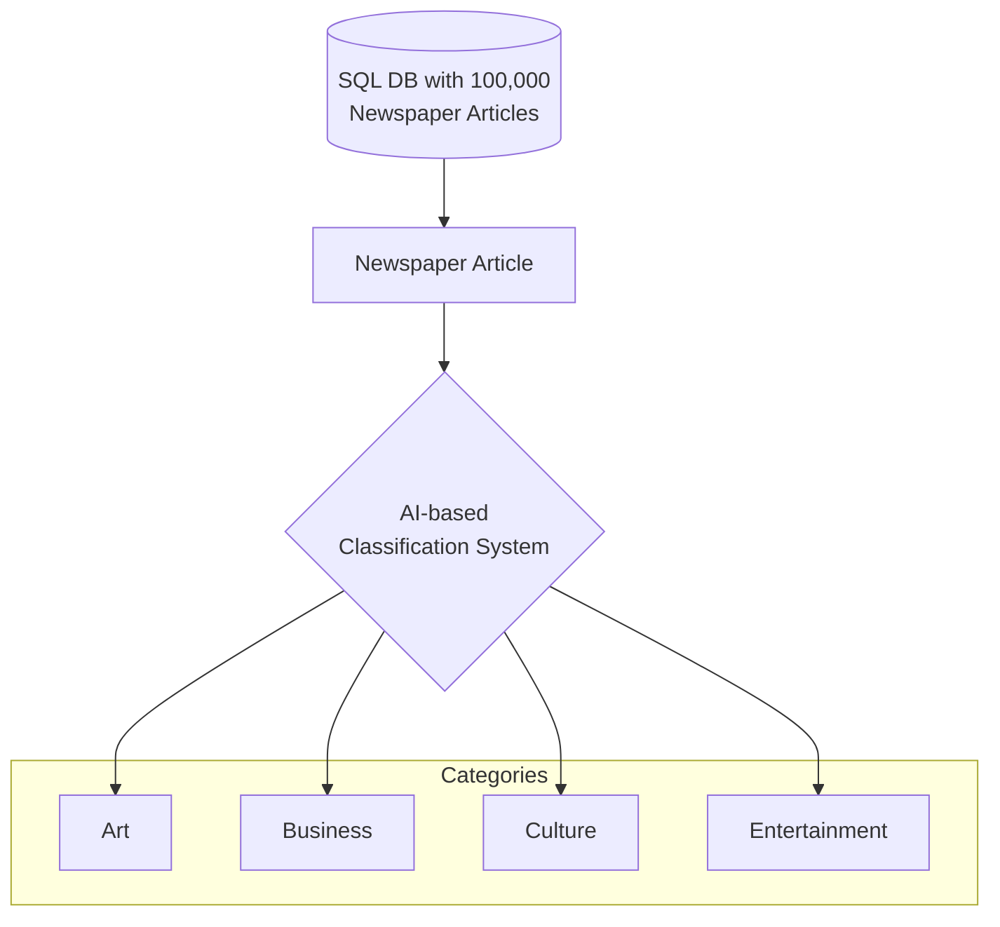
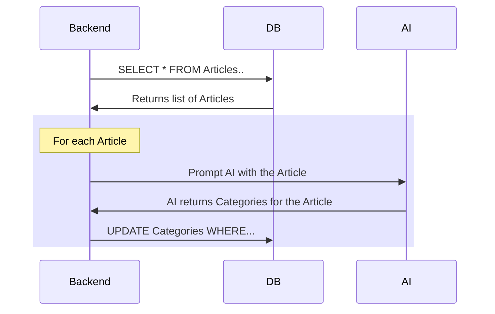

# Introduction

> 📖 **What is Generative AI?** Generative AI is a type of AI that can understand and generate human-like text. It can be used to perform a wide range of tasks, including data entry. It is also very **cost-effective**, as it **does not** require a team of data scientists and machine learning engineers to implement.

I was doing some cost calculations for some clients who were interested in the effectiveness of Generative AI in a data entry setting. The questions that came up were along the lines of:

* How much does it cost to use Generative AI?
* What are the cost savings compared to traditional methods of data entry?
* How does the cost of using Generative AI compare to the cost of hiring a team of data entry clerks?
* Are there any advantages to using Generative AI over traditional methods of data entry?

Before doing my calculations, I had some idea about how much money could be saved using GenAI. But, to be honest, the result was so dramatic that even I was surprised. According to my calculations, a whopping **97.84% reduction in unit cost of data entry** (!!) could be realized using Generative AI, using just prompting, without any custom fine-tuning or training of models.

I am sharing my results here in the form of a fictional case study. I hope this will be useful for anyone who is interested in the cost-effectiveness of Generative AI, especially in a data entry setting.

# What is Generative AI?

Before we dive into the case study, let's take a moment to understand what Generative AI is.

Generative AI is a type of AI that can understand and generate human-like text. It can be used to perform a wide range of tasks, including data entry. It is also very cost-effective, as **it does not require a team of data scientists and machine learning engineers to implement.** 

There are also no training costs, as the AI comes pre-trained on a broad base of source materials. You only have to provide clear instructions in plain text format, and the AI will do the rest. It is very scalable and flexible as a result.

Generative AI is also inexpensive. It is much cheaper than hiring data entry clerks. For a single article, the cost of using Generative AI is only a few cents.

# Case Study

## A new requirement for Acme News

> 📖 **What is Data classification?** Data Classification is a common task in software development. It involves taking a piece of data and assigning it to one or more categories. This is a common task in many industries, including news, e-commerce, and social media.

In this hypothetical scenario, Acme News is a large newspaper company. Acme's Product and Design teams have been hard at work re-designing the newspaper's main customer-facing website, which sees many millions of visitors per month.

Part of the redesign involves a Proof of Concept for a brand new "category" filter. This filter will let users rapidly navigate articles using one of exactly 4 categories:

* Art
* Business
* Culture
* Entertainment

The newspaper plans to expand these categories to several dozen in the future, but for now, they are starting with just these four. As new categories are added, the newspaper's database will need to be re-classified for each new category.

## The work involved

In addition to the normal work of software development, this feature requires a significant amount of data entry. This is because the newspaper's database contains 100,000 past articles that need to be classified into one or more of these four new categories, and each new article will need to be classified as it is published.

Furthermore, as the number of categories grows, the database will need to be re-classified for each new category. This is a significant amount of work, and it is also repetitive since Acme plans to grow the number of categories to several dozen in the next 5 years.

## Disadvantages of the current process

Acme has previously used data entry clerks to classify the articles. From experience, the manual data entry process has a few significant disadvantages, which is the reason why Acme is looking for a new solution.

* **Manual data entry is slow.** It takes a long time to read each article and then enter the categories into the database. This is a bottleneck for the project, since the new feature cannot be launched until all 100,000 articles have been classified.
* **It is also expensive.** The data entry clerks are paid by the hour, and the cost of hiring them adds up quickly. When a clerk leaves and a new one is hired, there is also a cost associated with training the new clerk.
* **This process is not scalable.** As the number of categories grows, it requires a re-classification of all the old articles for each new category. This is a significant amount of work, and it is also expensive.
* **And it isn't flexible, either.** As more categories are added, the data entry clerks need to be re-trained for each new category, which is an additional cost.

## 🧮 Calculating the cost difference

To compare the cost of using data entry clerks versus using Generative AI, we need to calculate the unit cost of each method. The unit cost is the cost associated with producing one unit of output. In this case, the unit cost is the cost of classifying one article. Then, we can compare the unit cost of using data entry clerks versus using Generative AI, and the cost savings of using Generative AI over traditional methods of data entry.

I have created a simple calculator below to compare the unit cost of using data entry clerks versus using Generative AI. As you can see, the unit cost of using Generative AI is much lower than that of using data entry clerks.

<div id="calculator-root"></div>

As we can see, if we used Generative AI, this would be much faster, cheaper, and more accurate than using data entry clerks. The AI could read the articles and then classify them into one or more categories. As the categories change, the AI could be modified to understand the new categories as well.

# Impact of using AI in data classification.

>💡 **Did you know:** Most commercial Generative AI projects **do not require data scientists or ML engineers**. Thanks to prompting, traditional web developers and software engineers can easily and cost-effectively implement AI-driven processes without the need for ML/AI specialists.

## Analysis of the cost difference

In the default example above, we estimate a cost of **$10,000** At an hourly salary of $10/hour, and with an average speed of 100 articles classified per hour. On the other hand, classifying 100,000 newspaper articles using GPT-3.5 Turbo, considering the specified input and output token costs, would approximately cost **$257.50**. This demonstrates the cost-effectiveness of AI-based classification over traditional manual methods.

## Advantages of using AI for data classification

### Cost Efficiency
AI classification dramatically reduces costs **from $10,000 to just $257.50** (a reduction of **97.84%**), enabling significant savings and operational scaling without major budget increases.

### Scalability
AI provides scalable solutions, easily handling large datasets without the cost and time escalation seen with manual labor, essential for modern data growth.

### Accuracy and Consistency
AI delivers consistent classification once trained, ensuring dataset uniformity. However, it requires monitoring to avoid biases.

### Time Savings
AI processes 100,000 articles almost instantly, offering massive time savings over manual methods that need 1,000 hours, speeding up decision-making.

### Enhanced Analysis Opportunities
Savings from AI allow for investment in deeper data analysis, yielding richer insights and more strategic outcomes.

### Workforce Shift
Transitioning to AI classification changes workforce demands, reducing manual processing roles in favor of AI oversight, training, and maintenance.

# The technical architecture of the new AI-driven system

>💡 **Did you know:** Generative AI systems are flexible. They can be rolled into either  a **batch process** or an **API action**. AI-driven processes can read database entries, classify them, and save the new information back to the database.

Currently, Acme Inc is not using AI for any of its projects. They believe that AI is expensive and that it requires a team of data scientists and machine learning engineers to implement. They also believe that AI is only useful for large companies like Google and Facebook. 

However, this is not true. AI is now accessible to small and medium-sized companies. This is because of a new type of AI called Generative AI. 

The new system will be designed to be a simple batch process. It will read the articles from the database, and then use a Generative AI model to classify the articles into the given categories. 

The AI model will return a list of categories that it believes the article belongs to. This list will then be stored in the database.

In traditional data science terms, this is a **Document Classification** task, which falls under the broader umbrella of Data Classification. Other tasks under the Data Classification umbrella include Named Entity Recognition (NER), Sentiment Analysis, and Intent Recognition.



The input data is a newspaper article that already exists inside Acme's SQL database. For example, here is a sample newspaper article as retrieved from their database.

```js
// source data format
{
  "title": "The Renaissance of Artisan Crafts in the Digital Age",
  "author": "Jordan Lee",
  "date_published": "2024-02-17",
  "category": "Art & Business",
  "tags": ["Artisan Crafts", "Digital Marketplace", "Cultural Preservation"],
  "content": "In an era dominated by mass production and digital technology, there's a growing movement towards the renaissance of artisan crafts, blending tradition with innovation....."
}
```

We need to add a new field to the database called "category" which will contain an array of strings. Each string will represent a category that the article belongs to. For example, the above article could be classified as "business" and "culture."

```js
// changes to the database
{
    "title": "The Renaissance of Artisan Crafts in the Digital Age",
    "author": "Jordan Lee",
    // ... etc
    "category": ["art", "business"] // this is a new JSON field
}
```

We will write a script that will read the article from the database, and then use a Generative AI model to classify the article into one or more categories. The AI model will a list of categories that it believes the article belongs to. We will then store this list in the database.

Ideally, the prompt should be a clear and concise question that the AI model can understand. It should also be a question that the AI model can answer accurately. The prompt should also be easy to understand and easy to maintain.

Here is an example of a prompt that we could use:

```markdown
There are four categories that an article can belong to: Art, Business, Culture, and Entertainment. Here are their definitions:

* Art: Articles about art, including visual arts, music, and literature.
* Business: Articles about business, including finance, economics, and entrepreneurship.
* Culture: Articles about culture, including traditions, customs, and social issues.
* Entertainment: Articles about entertainment, including movies, music, and television.

Please classify this article into one or more categories: Art, Business, Culture, Entertainment. Return the categories as a JSON list of strings. For example, `["art", "business"]` or `["culture"]`.

If the article does not belong to any of these categories, please return an empty list, `[]`.
```

Visualized in a sequence diagram, the flow looks like this. Notice that it's between the AI model, the database, and the backend script.



# Frequently Asked Questions

## Why is this exciting? (Apart from cost savings)

This is very exciting because it's low-hanging fruit. Not only are there massive cost savings to be realized, but it could actually be very easy to do, too.

* Generative AI work can be performed by web developers and software engineers.
* There is no need to hire specialists like data scientists or machine learning engineers.
* The code fits seamlessly into existing software built in Java, JavaScript, Python, etc.
* There is no need for changes to CI/CD pipelines or development processes.

## What kinds of teams can take advantage of this innovation?

Any software development team can now use AI, regardless of which programming language they are using. This is possible through API-based AI (for example, OpenAI GPT-3.5). If your code can make API calls, it can also take advantage of cheap industrial-grade AI.

## Do I need to train the AI model myself?

No. The AI comes pre-trained on a broad base of source materials which allows it to understand instructions in plain human language. There is no training involved; you only have to provide clear instructions in plain text format, and the AI will do the rest.

<script src="https://unpkg.com/mermaid@8.9.3/dist/mermaid.min.js"></script>
<script>
    document.addEventListener('DOMContentLoaded', () => {
        mermaid.initialize({
            startOnLoad:true,
            theme: "default",
        });
        window.mermaid.init(undefined, document.querySelectorAll('.language-mermaid'));
    });
</script>

<script>
    const calculatorDom = `
<table class="table">
    <tr>
        <th>Number of Articles</th>
        <td>
            <div class="flex flex-col gap-2">
                <input class="w-full" type="range" min="1000" max="1000000" value="100000" onInput="onInputChange()" id="numArticles">
                <p><span id="numArticlesValue">100000</span> Articles</p>
            </div>
        </td>
    </tr>
    <tr>
        <th>Manual Entry Speed (articles/hour)</th>
        <td>
            <div class="flex flex-col gap-2">
                <input type="range" min="50" max="200" value="100" onInput="onInputChange()" id="manSpeed">
                <p><span id="manSpeedValue">100</span> articles per hour</p>
            </div>
        </td>
    </tr>
    <tr>
        <th>Manual Entry Salary ($/hour)</th>
        <td>
            <div class="flex flex-col gap-2">
                <input type="range" min="1" max="30" value="10" onInput="onInputChange()" id="manSalary">
                <p>$<span id="manSalaryValue">10</span> per hour</p>
            </div>
        </td>
    </tr>
    <tr>
        <th>Average Article Length (words)</th>
        <td>
            <div class="flex flex-col gap-2">
                <input type="range" min="300" max="10000" value="5000" onInput="onInputChange()" id="avgArticleLength">
                <p><span id="avgArticleLengthValue">5000</span> words</p>
            </div>
        </td>
    </tr>
    <tr>
        <th>Total Manual Cost:</th>
        <td>
            <div>
                <strong class="text-error">$<span id="estimatedManualCost">10,000</span></strong>
                <p class="font-italic opacity-4">($<span id="manPerArticleCost">--</span> per article)</p>
            </div>
        </td>
    </tr>
    <tr>
        <th>Total Cost Using AI:</th>
        <td>
            <div>
                <strong>$<span id="estimatedAiCost">257.50</span></strong>
                <p class="font-italic opacity-4">($<span id="aiPerArticleCost">--</span> per article, using OpenAI GPT-3.5)</p>
            </div>
        </td>
    </tr>
    <tr>
        <th>Savings in Dollars:</th>
        <td class="text-success"><strong class="text-5">$<span id="estimatedSavings">--</span></strong></td>
    </tr>
    <tr>
        <th>Savings Percentage:</th>
        <td class="text-success"><strong class="text-5"><span id="estimatedPctSavings">--</span>%</strong></td>
    </tr>
</table>
<div class="link float-right cursor-pointer" onClick="resetToDefaults()">Reset To Default</div>
`;

    function resetToDefaults() {
        document.getElementById("numArticles").value = 100000;
        document.getElementById("manSpeed").value = 100;
        document.getElementById("manSalary").value = 10;
        document.getElementById("avgArticleLength").value = 5000;
        onInputChange();
    }

    function calculateManualCost() {
        const numArticles = parseInt(document.getElementById("numArticles").value, 10);
        const manSpeed = parseInt(document.getElementById("manSpeed").value, 10);
        const manSalary = parseInt(document.getElementById("manSalary").value, 10);
        
        const hours = numArticles / manSpeed;
        const cost = hours * manSalary;
        
        return cost;
    }

    function calculateAiCost() {
        const numArticles = parseInt(document.getElementById("numArticles").value, 10);
        const avgArticleLength = parseInt(document.getElementById("avgArticleLength").value, 10);

        const AVG_TOKENS_PER_WORD = 1.2;
        const totalInputTokens = (numArticles * avgArticleLength) / AVG_TOKENS_PER_WORD;
        const averageInputCostPer1000Tokens = 0.0005;
        const inputCost = averageInputCostPer1000Tokens * (totalInputTokens / 1000);

        const averageOutputLength = 50;
        const averageOutputCostPer1000Tokens = 0.0015;
        const totalOutputTokens = numArticles * averageOutputLength;
        const outputCost = averageOutputCostPer1000Tokens * (totalOutputTokens / 1000);

        const totalCost = inputCost + outputCost;

        return totalCost;
    }

    function onInputChange() {
        document.getElementById("numArticlesValue").innerText = document.getElementById("numArticles").value;
        document.getElementById("manSpeedValue").innerText = document.getElementById("manSpeed").value;
        document.getElementById("manSalaryValue").innerText = document.getElementById("manSalary").value.toLocaleString("en-US", {minimumFractionDigits: 2, maximumFractionDigits: 2});
        document.getElementById("avgArticleLengthValue").innerText = document.getElementById("avgArticleLength").value;
        
        const manCost = calculateManualCost();
        const aiCost = calculateAiCost();
        document.getElementById("estimatedManualCost").innerText = manCost.toLocaleString("en-US", {minimumFractionDigits: 2, maximumFractionDigits: 2});
        document.getElementById("estimatedAiCost").innerText = aiCost.toLocaleString("en-US", {minimumFractionDigits: 2, maximumFractionDigits: 2});
        document.getElementById("manPerArticleCost").innerText = (manCost / parseInt(document.getElementById("numArticles").value, 10)).toLocaleString("en-US", {minimumFractionDigits: 3, maximumFractionDigits: 3});
        document.getElementById("aiPerArticleCost").innerText = (aiCost / parseInt(document.getElementById("numArticles").value, 10)).toLocaleString("en-US", {minimumFractionDigits: 4, maximumFractionDigits: 4});

        const savings = manCost - aiCost;
        document.getElementById("estimatedSavings").innerText = savings.toLocaleString("en-US", {minimumFractionDigits: 2, maximumFractionDigits: 2});
        const savingsPct = ((savings) / manCost) * 100;
        document.getElementById("estimatedPctSavings").innerText = savingsPct.toLocaleString("en-US", {minimumFractionDigits: 2, maximumFractionDigits: 2});
    }

    document.addEventListener("DOMContentLoaded", () => {
        document.getElementById("calculator-root").innerHTML = calculatorDom;
        onInputChange(); // Initialize with default values
    });
</script>