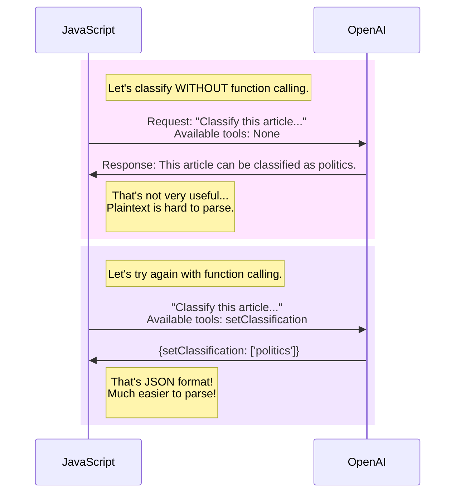

---

title:  How to reliably return well-structured JSON from LLMs using Function Calling.
layout: post
date:   2024-02-17
tags: openai gpt genai boring-ai
excerpt: GenAI often requires interoperability with traditional code. In this article, I show how to use function calling to retrieve structured JSON responses reliably from LLMs. An example using OpenAI GPT-3.5, with an explanatory diagram, is included.
---

# Introduction

> 📚 If you'd like to play around with the source code displayed in this article, you can grab it from [this GitHub repository](https://github.com/monarchwadia/blog-monarchwadia.com/tree/main/_code-samples/2024-02-18-function-calling-allows-interop-with-traditional-software.md). Enjoy!

One of the key concepts needed to truly harness the power of Large Language Models is getting it to play nicely with traditional software systems written in Java, JavaScript, Python, and other languages.

The problem is that traditional software systems rely on structured data, such as JSON, XML, and CSV, to communicate with other systems. Large Language Models, on the other hand, are not designed to work with structured data. They are designed to work with natural language, which is unstructured.

For example, if we wanted to classify an article using a large language model,  `This article is classified as Politics` is not useful. Instead, a much more useful format would be `["politics"]`, which is a JSON array.

In this article, I will explore how function calling enables Large Language Models to interoperate with traditional software, and provide code snippets to illustrate the concept.


# Using simple prompts to classify articles

> 🎓 **Interested in Data Classification or Data Entry using LLMs?** This example is taken from my article, [How Generative AI slashes data entry costs by 97% without training](/2024/02/12/ai-cost-reduction-for-data-entry). If you're actually working on a data classification or data entry problem right now (or if you're just curious), the case study in that article might be super useful and interesting to you!

Let's say we wanted to classify 100,000 newspaper articles into categories such as sports, politics, and entertainment. Instead of doing this work manually, we could use GenAI to classify them. Using API calls to OpenAI, we could classify the articles using simple prompts such as "classify this article as sports" or "classify this article as politics".

As a first pass, we could use the following code to classify an article. 

```python
from openai import OpenAI

# Enter your own API key here.
OPENAI_API_KEY='sk-_______________________';
client = OpenAI(api_key=OPENAI_API_KEY)

# This is the system prompt. This instructs the model what to do.
system_prompt = """
Classify the following article into one of the following categories.

* sports
* politics
* entertainment

An article can have multiple classifications. However, classifications cannot repeat. If the article has no classifications, then this array should be empty.

output in JSON format of strings[]
"""

# This article could be retrieved from a database
article = """
# New government initiative by government is promising for economic growth and innovation.

The government announced a new tech initiative today aiming to boost the national economy and foster innovation. The initiative, called "Tech for All," will provide funding and resources to tech startups and entrepreneurs across the country. The government hopes that this initiative will help create new jobs and stimulate economic growth in the tech sector.

etc...
"""

response = client.chat.completions.create(
  model="gpt-3.5-turbo",
  messages=[
    {"role": "system", "content": system_prompt},
    {"role": "user", "content": article},
  ]
)

# The response will be in JSON format, but embedded inside a markdown fence block.
# It is VERY DIFFICULT to coax the OpenAI API to return the response in a different format.
# Here's what the typical response looks like:
#
# ```json
# ["politics"]
# ```
print(response.choices[0].message.content)
```

# The response is not useful... yet.

With this code, the response would be simple plain text. `GPT-3.5` is trained to respond in human language, sometimes formatting its responses as markdown blocks. Here is a typical response:

```markdown
This article is classified as politics.
```

Unfortunately, this is not a useful response, as the output is in plain text.  Plain text is not a format that is easily interoperable with traditional software systems. It needs flaky parsing and is not easily machine-readable.

What we need is a response in a structured format, such as JSON. This would allow us to easily integrate the response with traditional software systems. Something like the following:

```json
["politics"]
```

But unfortunately, that's not what we get.

But how can we get the LLM to return a response in JSON format? Speaking from experience, it is almost impossible to coax the OpenAI API to return the response in machine-readable JSON just by prompting.

So, what can we do?

This is where Function Calling comes in.

# The Solution: Function Calling lets us reliably return well-structured JSON

Function Calling is a feature of the OpenAI API that allows you to call a function from within a prompt. This function can be used to return well-structured data, such as JSON, XML, or CSV. 

This feature is quickly gaining popularity; there are several open source projects that allow function calling with open source LLMs, and [Claude 2.1 also features experimental capabilities for Tool Use](https://docs.anthropic.com/claude/docs/claude-2p1-guide), which includes Function Calling.

# How does Function Calling work?

The "Function Calling" feature is a bit of a misnomer. The LLM is not really calling a function in a local runtime context. Instead, it's passing back the function name and parameters to our script, in an effort to call the tool. It is up to our script to handle the function call and return the raw response of the script to the LLM.

You can read more about Function Calling in the [OpenAI API documentation](https://platform.openai.com/docs/guides/function-calling).

# Why use Function Calling?

Function calling gives us two advantages:

1. It allows us to collect the output in JSON, which is a machine-readable format. In essence, it lets us create an interface, and tries to make the AI system work like a traditional software system.
2. It allows us to provide additional information about the article, such as the title, author, and publication date. This information could include data types such as `string`, `integer`, `float`, `date`, etc. This informs the AI system about the data types it should expect and how to handle them.

# So, how can we use Function Calling to classify an article?

Let's look into how we can use Function Calling to classify an article.

First, we will provide the LLM with a hypothetical function called `setClassification()`. that takes an array of strings which contains the classifications of the article.

Then, upon being prompted, the LLM will respond with a function call request. In other words, the LLM will ask us to execute the `setClassification()` function on our own machine with a set of parameters that it provides.

We will capture this request, parse it, and store the classifications in a JSON format.

## Diagram comparing the two approaches

Here, I've created a sequence diagram to illustrate the difference between the two approaches. The first approach does not use function calling, while the second approach does.



# How to include Function Calling in our code

To provide the LLM with a function, we need to include a `tools` array in the API call. This array contains a description of the function we want to provide to the LLM.

This `tools` array is included as an argument in the `client.chat.completions.create()` method.

Here is the `tools` array we will use in our example.

```python
tools=[
    {
        "type": "function",
        "function": {
            "name": "setClassification",
            "description": "This function takes an array of strings. It sets the classification of the article. An article can have multiple classifications.",
            "parameters": {
                "type": "object",
                "properties": {
                    "classifications": {
                        "type": "array",
                        "description": "The classifications of the article. An article can have multiple classifications. However, classifications cannot repeat. If the article has no classifications, then this array should be empty.",
                        "items": {
                            "type": "string",
                            "enum": ["sports", "politics", "entertainment"],
                        },
                    }
                },
                "required": ["classifications"],
            },
        },
    }
]
```

In this example, we are providing the LLM with a function called `setClassification`. This function takes an array of strings, which contains the classifications of the article. The classifications can be `sports`, `politics`, or `entertainment`. If the article has no classifications, then this array should be empty.


# Updated code with Function Calling

Finally, putting it all together, here is the updated code with function calling.

```python
from openai import OpenAI
import json

# Enter your own API key here.
OPENAI_API_KEY = "sk-_______________________"
client = OpenAI(api_key=OPENAI_API_KEY)

# This is the system prompt. This instructs the model what to do.
system_prompt = """
Classify the following article into one of the following categories.

* sports
* politics
* entertainment

An article can have multiple classifications. However, classifications cannot repeat. If the article has no classifications, then this array should be empty.

output in JSON format of strings[]
"""

# This article could be retrieved from a database
article = """
# New government initiative by government is promising for economic growth and innovation.

The government announced a new tech initiative today aiming to boost the national economy and foster innovation. The initiative, called "Tech for All," will provide funding and resources to tech startups and entrepreneurs across the country. The government hopes that this initiative will help create new jobs and stimulate economic growth in the tech sector.

etc...
"""

response = client.chat.completions.create(
    model="gpt-3.5-turbo",
    messages=[
        {"role": "system", "content": system_prompt},
        {"role": "user", "content": article},
    ],
    tools=[
        {
            "type": "function",
            "function": {
                "name": "setClassification",
                "description": "This function takes an array of strings. It sets the classification of the article. An article can have multiple classifications.",
                "parameters": {
                    "type": "object",
                    "properties": {
                        "classifications": {
                            "type": "array",
                            "description": "The classifications of the article. An article can have multiple classifications. However, classifications cannot repeat. If the article has no classifications, then this array should be empty.",
                            "items": {
                                "type": "string",
                                "enum": ["sports", "politics", "entertainment"],
                            },
                        }
                    },
                    "required": ["classifications"],
                },
            },
        }
    ],
)

# The response will be in JSON format.
# Here's what the typical response looks like:
# ['politics']
response_string = response.choices[0].message.tool_calls[0].function.arguments
response_json = json.loads(response_string)
print(response_json["classifications"])
```

# The results

The response will be in JSON format. Here's what the typical response looks like:

```json
["politics"]
```

Since this is plain JSON, it becomes much easier for our JavaScript code to use the response. It is now machine-readable and can be easily integrated with traditional software systems. Awesome!

# Conclusion

Function calling is a powerful feature that allows LLMs to interoperate with traditional software systems. It allows us to collect the output in JSON, which is a machine-readable format. In this article, I have shown how to use function calling to retrieve structured JSON responses reliably from LLMs. I have also provided an example using OpenAI GPT-3.5, with an explanatory diagram. I hope this article has been helpful to you!


<script src="https://unpkg.com/mermaid@8.9.3/dist/mermaid.min.js"></script>
<script>
    document.addEventListener('DOMContentLoaded', () => {
        mermaid.initialize({
            startOnLoad:true,
            theme: "default",
        });
        window.mermaid.init(undefined, document.querySelectorAll('.language-mermaid'));
    });
</script>