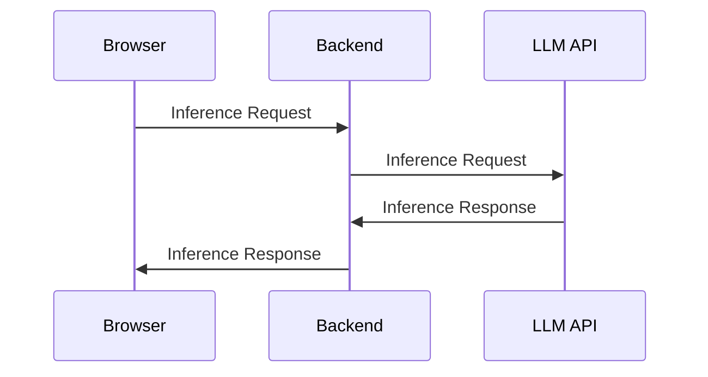
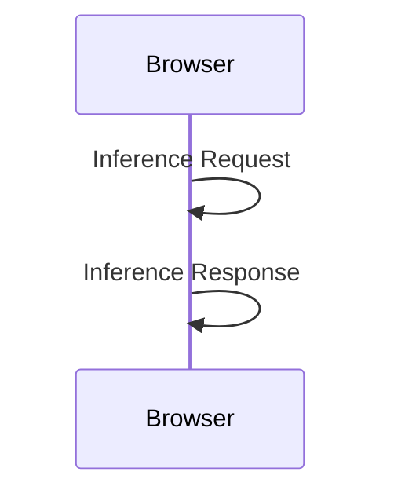

---

title:  Web LLM lets you run LLMs natively in your frontend.
layout: post
date:   2024-02-23
tags: openai gpt genai boring-ai
excerpt: Web LLM is a new project that lets you run LLMs in the browser. This means you can run LLMs on your own machine, without needing to send data to a server. It's a huge step forward for privacy and cost savings. Here's how to use it.
toc: true
---

I recently discovered a new project called [Web LLM](https://webllm.mlc.ai/), which provides a runtime inside the browser for running LLMs. This means:

1. LLMs no longer run on expensive servers.
2. Inference is done locally on users' machines.
3. It's private because user data never leaves their browser.
4. There is no vendor lock-in.


# Baseline state diagram: Here's a typical example of current LLM usage:



# New capability diagram: Here's how Web LLM works:



# Implications

This is a huge step forward for privacy and cost savings. It means that you can run LLMs on your users' machines, without needing to send data to a server.

## Huge cost savings for SaaS companies & unlimited scalability

The thing I'm most excited about is the cost savings for SaaS companies.

As long as the user has a machine that can run LLMs, the cost of running LLMs is now $0 for the company. The cost is now borne by the user (and is effectively $0 for them, too, since our SaaS will now be using the user's own GPU).

This is a huge improvement from the current state, where we have to pay for the server costs of running LLMs.

This means that we can provide LLM-powered services to many more users, without needing to worry about the cost of running the LLMs. Scaling up is as simple as adding more users, and we don't need to worry about the cost of running the LLMs.

## Privacy

There are also privacy implications. Since the data never leaves the user's machine, it's much more private than the current state, where data is sent to a server for processing.

## No vendor lock-in

Also, since all the models are open source, there is no vendor lock-in. You can run any model you want, without needing to pay for a license. You can even provide users with the ability to choose which model they want to use, or proactively switch between models based on the user's needs.

## No more need for Ollama to run local LLMs

This also means that we no longer need to use Ollama to run LLMs. We can run LLMs natively in the browser, without needing to send data to a server. The WebGPU standard lets the LLM punch through the browser and access the GPU directly.

# How to install and use Web LLM

You can use Web LLM simply by `npm install`

```bash
npm i @mlc-ai/web-llm 
```

Add this in your HTML

```html
<!-- index.html -->
<div id="progress"></div>
<script src="index.ts"></script>
```

And then, in your JavaScript code:

```typescript
// index.ts
import * as webllm from "@mlc-ai/web-llm";

// execute on page load
document.addEventListener("DOMContentLoaded", async () => {
  // get the progress reporter element
  const progressReporter = document.getElementById("progress")!;

  // create a new chat module. tell it to print the progress of the initialization.
  const chat = new webllm.ChatModule();
  chat.setInitProgressCallback((report) => progressReporter.innerText = report.text);

  // load the RedPajama-INCITE-Chat-3B model. (There are others availalbe, too).
  // this is several gigabytes of data, so it may take a while to load. 
  // don't do this on a mobile connection...
  try {
    await chat.reload("RedPajama-INCITE-Chat-3B-v1-q4f32_1");
  } catch (e: any) {
    console.error(e);
    progressReporter.innerText = e.message || "An unexpected error occurred.";
    return;
  }

  // finally, generate a response to a question
  const QUESTION = "What is the capital of canada?";
  await chat.generate(QUESTION, (_step, message) => {
    progressReporter.innerText = `${QUESTION} -> ${message}`;
  });
});
```

## Results


## Current limitations

Since it's a new project, Web LLM has a few limitations:

* Right now, it only supports the latest desktop browsers (because WebGPU is only available on these). [Check latest availability here](https://developer.mozilla.org/en-US/docs/Web/API/WebGPU_API#browser_compatibility)
* It has a [limited number of LLMs](https://github.com/mlc-ai/mlc-llm) available.
* It doesn't support function calling, although it's [actively being worked on](https://github.com/mlc-ai/web-llm/issues/276).
* The LLMs are local models (3B, 7B and 13B), and won't be as powerful as GPT-4, Claude, or other cloud-based models.

# FAQs

## Isn't this useless for RAG?

This is a semi-valid concern. This client-side library will not be able to do inference close to the database. However, it is possible to run a RAG-like architecture on the client side. For example, you can run a RAG-like architecture on the client side by using a local SQLite database. You can also surface search results from a server-side database, and then run the LLM on the client side. This is a good way to get the best of both worlds: free LLM inference on the client side, and a full RAG pipeline with embeddings on the server side.

Also, RAG is not the only capability or architecture that LLMs enable. For example, think about the situation where you want a UI that is commanded by a chatbot assistant. "Hey Gmail, compose an email about _____ for me." Or, another example, "Hey Figma, create a button that's blue and has a border radius of 5px." These things can be free for the company if they run on the client side.

## How is this different from Ollama?

Ollama is a great project that exposes an LLM via an OpenAI-compatible API. It can either deploy on the server side or locally on your laptop. 

If deployed on the server side, the company needs to bear the costs of a powerful server instance, which can be $100's to $1000's of dollars per month. On the other hand, if deployed on the user's laptop, Ollama requires local installation. 

Web LLM is different because it runs LLMs in the browser. This means you get the best of both worlds: any average used with a powerful enough laptop will be able to run LLMs without installing any additional software; and, the company doesn't need to bear the cost of running LLMs on a server, either.

## Is there a live demo?

Yes! You can try out the live demo at [https://webllm.mlc.ai](https://webllm.mlc.ai). Note that right now (Feb 2024), it only supports the latest browsers on desktop only, excluding Firefox. (Chrome works for sure)