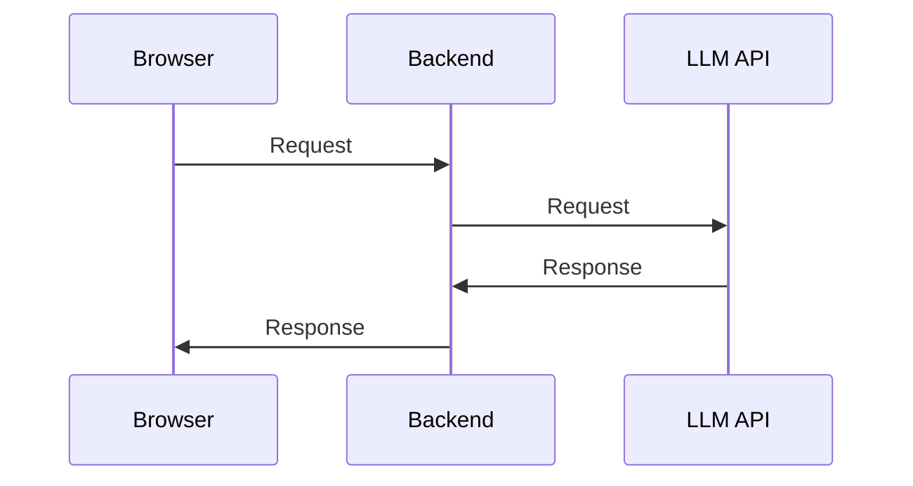
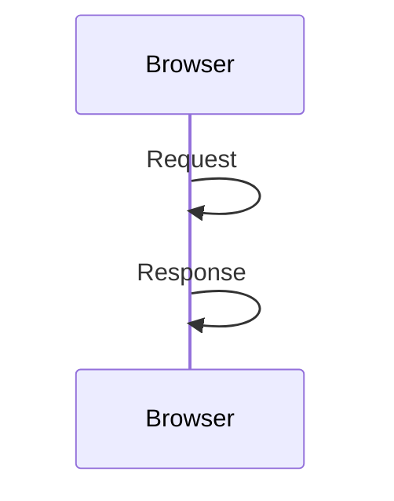

---

title:  Web LLM lets you run LLMs natively in your frontend.
layout: post
date:   2024-02-23
tags: openai gpt genai boring-ai
excerpt: Web LLM is a new project that lets you run LLMs in the browser. This means you can run LLMs on your own machine, without needing to send data to a server. It's a huge step forward for privacy and cost savings. Here's how to use it.
---

I recently discovered a new project called [Web LLM](https://webllm.mlc.ai/), which provides a runtime inside the browser for running LLMs. This means:

1. LLMs no longer run on expensive servers.
2. Inference is done locally on users' machines.
3. It's private because user data never leaves their browser.
4. There is no vendor lock-in.


# Baseline state: Here's a typical example of current LLM usage:



# New capability: Here's how Web LLM works:



# Implications

This is a huge step forward for privacy and cost savings. It means that you can run LLMs on your users' machines, without needing to send data to a server.

Since the unit costs of inference are now borne by the user, our cost for providing LLM-powered services is $0. This is a huge improvement from the current state, where we have to pay for the server costs of running LLMs.

There are also privacy implications. Since the data never leaves the user's machine, it's much more private than the current state, where data is sent to a server for processing.

Also, since all the models are open source, there is no vendor lock-in. You can run any model you want, without needing to pay for a license. You can even provide users with the ability to choose which model they want to use, or proactively switch between models based on the user's needs.

# How to install and use Web LLM

You can use Web LLM simply by `npm install`

```bash
npm i @mlc-ai/web-llm 
```

Add this in your HTML

```html
<!-- index.html -->
<div id="progress"></div>
<script src="index.ts"></script>
```

And then, in your JavaScript code:

```typescript
// index.ts
import * as webllm from "@mlc-ai/web-llm";

// execute on page load
document.addEventListener("DOMContentLoaded", async () => {
  // get the progress reporter element
  const progressReporter = document.getElementById("progress")!;

  // create a new chat module. tell it to print the progress of the initialization.
  const chat = new webllm.ChatModule();
  chat.setInitProgressCallback((report) => progressReporter.innerText = report.text);

  // load the RedPajama-INCITE-Chat-3B model. (There are others availalbe, too).
  // this is several gigabytes of data, so it may take a while to load. 
  // don't do this on a mobile connection...
  try {
    await chat.reload("RedPajama-INCITE-Chat-3B-v1-q4f32_1");
  } catch (e: any) {
    console.error(e);
    progressReporter.innerText = e.message || "An unexpected error occurred.";
    return;
  }

  // finally, generate a response to a question
  const QUESTION = "What is the capital of canada?";
  await chat.generate(QUESTION, (_step, message) => {
    progressReporter.innerText = `${QUESTION} -> ${message}`;
  });
});
```

## Results


## Current limitations

Since it's a new project, Web LLM has a few limitations:

* Right now, it only supports the latest desktop browsers (because WebGPU is only available on these). [Check latest availability here](https://developer.mozilla.org/en-US/docs/Web/API/WebGPU_API#browser_compatibility)
* It has a [limited number of LLMs](https://github.com/mlc-ai/mlc-llm) available.
* It doesn't support function calling, although it's [actively being worked on](https://github.com/mlc-ai/web-llm/issues/276).
* The LLMs are local models (3B, 7B and 13B), and won't be as powerful as GPT-4, Claude, or other cloud-based models.